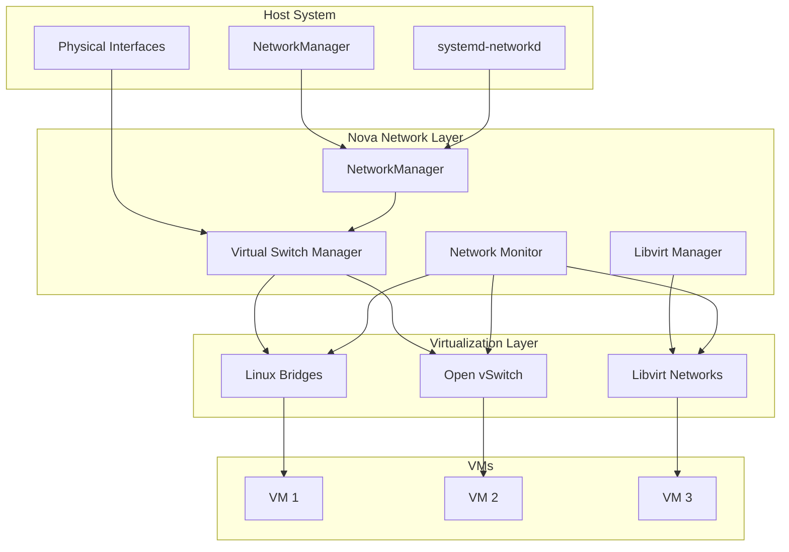

# Nova Networking Technical Documentation

This document provides comprehensive technical details about Nova's advanced networking capabilities, designed specifically for Arch Linux + KDE + KVM + libvirt environments.

## Table of Contents
- [Overview](#overview)
- [Virtual Switch Management](#virtual-switch-management)
- [Libvirt Network Integration](#libvirt-network-integration)
- [Advanced Bridge Features](#advanced-bridge-features)
- [DHCP and NAT Management](#dhcp-and-nat-management)
- [Network Monitoring](#network-monitoring)
- [Arch Linux Integration](#arch-linux-integration)
- [Performance Optimization](#performance-optimization)
- [Security Features](#security-features)
- [Troubleshooting](#troubleshooting)

## Overview

Nova's networking system provides enterprise-grade virtual networking capabilities that rival VMware vSphere and HyperV, specifically optimized for Linux environments.

### Key Features
- **Multiple switch types**: Linux bridges, Open vSwitch (OVS)
- **Libvirt integration**: Full XML network management
- **Advanced bridging**: STP, VLAN, port mirroring
- **DHCP/NAT management**: dnsmasq and iptables integration
- **Real-time monitoring**: Bandwidth tracking, topology visualization
- **Arch Linux optimization**: systemd-networkd, NetworkManager integration

### Architecture Overview



## Virtual Switch Management

### Switch Types

#### 1. Linux Bridge
Native Linux bridge with kernel-level switching.

**Advantages:**
- Kernel-native performance
- Mature and stable
- Low CPU overhead
- Integrated with standard Linux tools

**Use Cases:**
- Simple VM networking
- Basic VLAN support
- Standard enterprise environments

**Technical Implementation:**
```rust
pub struct LinuxBridge {
    pub name: String,
    pub interfaces: Vec<String>,
    pub stp_enabled: bool,
    pub vlan_filtering: bool,
    pub multicast_snooping: bool,
}

impl LinuxBridge {
    pub async fn create(&self) -> Result<()> {
        // Create bridge using ip command
        Command::new("ip")
            .args(&["link", "add", "name", &self.name, "type", "bridge"])
            .output()?;

        // Configure STP if enabled
        if self.stp_enabled {
            self.configure_stp().await?;
        }

        Ok(())
    }
}
```

#### 2. Open vSwitch (OVS)
Software-defined networking with advanced features.

**Advantages:**
- Advanced flow control
- OpenFlow support
- VLAN and tunnel support
- Port mirroring and QoS
- Network virtualization overlays

**Use Cases:**
- Software-defined networking
- Multi-tenant environments
- Advanced network monitoring
- OpenStack integration

**Technical Implementation:**
```rust
pub struct OpenVSwitch {
    pub name: String,
    pub ports: Vec<OvsPort>,
    pub controller: Option<String>,
    pub protocols: Vec<String>,
}

impl OpenVSwitch {
    pub async fn create(&self) -> Result<()> {
        // Create OVS bridge
        Command::new("ovs-vsctl")
            .args(&["add-br", &self.name])
            .output()?;

        // Configure controller if specified
        if let Some(controller) = &self.controller {
            self.set_controller(controller).await?;
        }

        Ok(())
    }
}
```

### Switch Creation and Management

```bash
# Create Linux bridge
nova network create-switch br0 \
  --type linux-bridge \
  --stp-enable \
  --interfaces eth0

# Create OVS bridge with advanced features
nova network create-switch ovs0 \
  --type openvswitch \
  --openflow-version 1.3 \
  --controller tcp:192.168.1.100:6653

# VLAN configuration
nova network configure-switch br0 \
  --vlan 100 \
  --vlan-filtering \
  --trunk-ports eth0

# Port mirroring setup
nova network mirror-port ovs0 \
  --source vm1-port \
  --destination vm2-port \
  --mirror-type ingress,egress
```

### Bridge Configuration

```rust
pub struct BridgeConfig {
    pub name: String,
    pub stp: bool,
    pub forward_delay: u32,      // STP forward delay (seconds)
    pub hello_time: u32,         // STP hello time (seconds)
    pub max_age: u32,            // STP max age (seconds)
    pub aging_time: u32,         // MAC aging time (seconds)
    pub multicast_snooping: bool,
    pub vlan_filtering: bool,
    pub priority: u16,           // Bridge priority for STP
}
```

## Libvirt Network Integration

### Network Types

#### 1. NAT Networks
Provide outbound connectivity with address translation.

```xml
<network>
  <name>nova-nat</name>
  <forward mode='nat'>
    <nat>
      <port start='1024' end='65535'/>
    </nat>
  </forward>
  <bridge name='virbr-nova-nat' stp='on' delay='0'/>
  <ip address='192.168.100.1' netmask='255.255.255.0'>
    <dhcp>
      <range start='192.168.100.2' end='192.168.100.254'/>
      <host mac='52:54:00:12:34:56' name='web-server' ip='192.168.100.10'/>
    </dhcp>
  </ip>
</network>
```

#### 2. Bridge Networks
Direct connection to physical networks.

```xml
<network>
  <name>nova-bridge</name>
  <forward mode='bridge'/>
  <bridge name='br0'/>
</network>
```

#### 3. Isolated Networks
VM-to-VM communication only, no external access.

```xml
<network>
  <name>nova-isolated</name>
  <bridge name='virbr-isolated' stp='on' delay='0'/>
  <ip address='10.0.0.1' netmask='255.255.255.0'>
    <dhcp>
      <range start='10.0.0.2' end='10.0.0.254'/>
    </dhcp>
  </ip>
</network>
```

### Network XML Management

```rust
pub struct LibvirtNetworkManager {
    networks: HashMap<String, LibvirtNetwork>,
}

impl LibvirtNetworkManager {
    pub async fn create_network(&mut self, config: &NetworkConfig) -> Result<()> {
        let xml = self.generate_network_xml(config)?;

        // Write XML to temporary file
        let temp_file = format!("/tmp/nova-network-{}.xml", config.name);
        std::fs::write(&temp_file, xml)?;

        // Define network in libvirt
        let output = Command::new("virsh")
            .args(&["net-define", &temp_file])
            .output()?;

        if output.status.success() {
            // Start network
            Command::new("virsh")
                .args(&["net-start", &config.name])
                .output()?;

            // Set autostart
            if config.autostart {
                Command::new("virsh")
                    .args(&["net-autostart", &config.name])
                    .output()?;
            }
        }

        std::fs::remove_file(&temp_file)?;
        Ok(())
    }
}
```

## Advanced Bridge Features

### Spanning Tree Protocol (STP)

STP prevents network loops in bridged environments.

```rust
pub struct StpConfig {
    pub enabled: bool,
    pub priority: u16,           // Bridge priority (0-65535)
    pub forward_delay: u32,      // 4-30 seconds
    pub hello_time: u32,         // 1-10 seconds
    pub max_age: u32,           // 6-40 seconds
    pub path_cost: HashMap<String, u32>, // Interface costs
}

impl StpConfig {
    pub async fn apply(&self, bridge: &str) -> Result<()> {
        // Enable STP
        Command::new("ip")
            .args(&["link", "set", "dev", bridge, "type", "bridge", "stp_state", "1"])
            .output()?;

        // Set bridge priority
        let priority_path = format!("/sys/class/net/{}/bridge/priority", bridge);
        std::fs::write(priority_path, self.priority.to_string())?;

        // Configure timing parameters
        self.set_bridge_parameter(bridge, "forward_delay", self.forward_delay).await?;
        self.set_bridge_parameter(bridge, "hello_time", self.hello_time).await?;
        self.set_bridge_parameter(bridge, "max_age", self.max_age).await?;

        Ok(())
    }
}
```

### VLAN Support

#### Native VLAN Configuration
```bash
# Create VLAN interface
nova network create-vlan eth0 100 --name eth0.100

# Add VLAN interface to bridge
nova network add-interface br0 eth0.100

# Configure VLAN filtering on bridge
nova network configure-bridge br0 --vlan-filtering --default-vlan 1
```

#### OVS VLAN Configuration
```bash
# Add port with VLAN tag
nova network ovs-add-port ovs0 vm1 --vlan 100

# Configure trunk port
nova network ovs-add-port ovs0 uplink --trunk 100,200,300

# VLAN translation
nova network ovs-configure-port ovs0 vm1 --vlan-mode access --vlan 100
```

### Port Mirroring

Port mirroring enables network monitoring and troubleshooting.

```rust
pub struct PortMirror {
    pub bridge: String,
    pub source_ports: Vec<String>,
    pub destination_port: String,
    pub mirror_type: MirrorType,
    pub filter: Option<MirrorFilter>,
}

pub enum MirrorType {
    Ingress,    // Incoming traffic only
    Egress,     // Outgoing traffic only
    Both,       // Bidirectional traffic
}

impl PortMirror {
    pub async fn create_ovs_mirror(&self) -> Result<()> {
        // Create mirror in OVS
        let mirror_name = format!("mirror-{}", uuid::Uuid::new_v4());

        Command::new("ovs-vsctl")
            .args(&["--", "--id=@m", "create", "mirror", &format!("name={}", mirror_name)])
            .args(&["--", "set", "bridge", &self.bridge, "mirrors=@m"])
            .output()?;

        Ok(())
    }
}
```

### Quality of Service (QoS)

```bash
# Configure bandwidth limits
nova network qos vm1-port \
  --ingress-rate 100Mbps \
  --egress-rate 50Mbps \
  --burst-size 10MB

# Traffic prioritization
nova network qos vm1-port \
  --priority high \
  --dscp 46 \
  --class realtime
```

## DHCP and NAT Management

### DHCP Server (dnsmasq Integration)

```rust
pub struct DhcpServer {
    pub interface: String,
    pub config: DhcpConfig,
    pub static_leases: HashMap<String, StaticLease>,
    pub lease_file: PathBuf,
    pub pid_file: PathBuf,
}

impl DhcpServer {
    pub async fn start(&self) -> Result<()> {
        let config_content = self.generate_dnsmasq_config()?;
        let config_file = format!("/tmp/nova-dhcp-{}.conf", self.interface);

        std::fs::write(&config_file, config_content)?;

        // Start dnsmasq
        Command::new("dnsmasq")
            .args(&["-C", &config_file])
            .args(&["--pid-file", &self.pid_file.to_string_lossy()])
            .args(&["--dhcp-leasefile", &self.lease_file.to_string_lossy()])
            .spawn()?;

        Ok(())
    }

    fn generate_dnsmasq_config(&self) -> Result<String> {
        let mut config = String::new();

        // Basic configuration
        config.push_str(&format!("interface={}\n", self.interface));
        config.push_str(&format!("dhcp-range={},{},{},{}s\n",
            self.config.range_start,
            self.config.range_end,
            self.config.subnet_mask,
            self.config.lease_time
        ));

        // DNS servers
        for dns in &self.config.dns_servers {
            config.push_str(&format!("dhcp-option=6,{}\n", dns));
        }

        // Gateway
        config.push_str(&format!("dhcp-option=3,{}\n", self.config.gateway));

        // Static leases
        for (mac, lease) in &self.static_leases {
            config.push_str(&format!("dhcp-host={},{},{}\n",
                mac, lease.ip, lease.hostname));
        }

        // Performance and security options
        config.push_str("bind-interfaces\n");
        config.push_str("log-dhcp\n");
        config.push_str("dhcp-authoritative\n");

        Ok(config)
    }
}
```

### NAT Configuration (iptables Integration)

```rust
pub struct NatManager {
    pub rules: Vec<NatRule>,
    pub port_forwards: Vec<PortForward>,
}

impl NatManager {
    pub async fn configure_nat(&self, config: &NatConfig) -> Result<()> {
        // Enable IP forwarding
        std::fs::write("/proc/sys/net/ipv4/ip_forward", "1")?;

        // Add masquerade rule
        Command::new("iptables")
            .args(&["-t", "nat", "-A", "POSTROUTING"])
            .args(&["-o", &config.external_interface])
            .args(&["-j", "MASQUERADE"])
            .output()?;

        // Add forward rules
        Command::new("iptables")
            .args(&["-A", "FORWARD"])
            .args(&["-i", &config.internal_interface])
            .args(&["-o", &config.external_interface])
            .args(&["-j", "ACCEPT"])
            .output()?;

        Command::new("iptables")
            .args(&["-A", "FORWARD"])
            .args(&["-i", &config.external_interface])
            .args(&["-o", &config.internal_interface])
            .args(&["-m", "state", "--state", "RELATED,ESTABLISHED"])
            .args(&["-j", "ACCEPT"])
            .output()?;

        Ok(())
    }

    pub async fn add_port_forward(&self, forward: &PortForward) -> Result<()> {
        // DNAT rule for incoming traffic
        Command::new("iptables")
            .args(&["-t", "nat", "-A", "PREROUTING"])
            .args(&["-i", &forward.external_interface])
            .args(&["-p", &forward.protocol])
            .args(&["--dport", &forward.external_port.to_string()])
            .args(&["-j", "DNAT"])
            .args(&["--to-destination", &format!("{}:{}", forward.internal_ip, forward.internal_port)])
            .output()?;

        // Allow forwarding
        Command::new("iptables")
            .args(&["-A", "FORWARD"])
            .args(&["-d", &forward.internal_ip])
            .args(&["-p", &forward.protocol])
            .args(&["--dport", &forward.internal_port.to_string()])
            .args(&["-j", "ACCEPT"])
            .output()?;

        Ok(())
    }
}
```

## Network Monitoring

### Real-time Bandwidth Monitoring

```rust
pub struct NetworkMonitor {
    stats_history: HashMap<String, Vec<NetworkStats>>,
    bandwidth_history: HashMap<String, Vec<BandwidthUsage>>,
}

impl NetworkMonitor {
    pub async fn start_monitoring(&mut self, interfaces: Vec<String>) -> Result<()> {
        for interface in interfaces {
            let interface_clone = interface.clone();
            let stats_clone = self.stats_history.clone();

            tokio::spawn(async move {
                loop {
                    if let Ok(stats) = Self::collect_interface_stats(&interface_clone).await {
                        let mut stats_map = stats_clone.lock().unwrap();
                        stats_map.entry(interface_clone.clone())
                            .or_insert_with(Vec::new)
                            .push(stats);
                    }

                    tokio::time::sleep(Duration::from_secs(1)).await;
                }
            });
        }

        Ok(())
    }

    async fn collect_interface_stats(interface: &str) -> Result<NetworkStats> {
        let proc_net_dev = std::fs::read_to_string("/proc/net/dev")?;

        for line in proc_net_dev.lines() {
            if line.contains(interface) && line.contains(":") {
                let parts: Vec<&str> = line.split_whitespace().collect();
                if parts.len() >= 17 {
                    return Ok(NetworkStats {
                        interface: interface.to_string(),
                        timestamp: SystemTime::now()
                            .duration_since(UNIX_EPOCH)
                            .unwrap()
                            .as_secs(),
                        rx_bytes: parts[1].parse().unwrap_or(0),
                        tx_bytes: parts[9].parse().unwrap_or(0),
                        rx_packets: parts[2].parse().unwrap_or(0),
                        tx_packets: parts[10].parse().unwrap_or(0),
                        rx_errors: parts[3].parse().unwrap_or(0),
                        tx_errors: parts[11].parse().unwrap_or(0),
                    });
                }
            }
        }

        Err(NovaError::NetworkNotFound(interface.to_string()))
    }
}
```

### Network Topology Discovery

```rust
pub struct TopologyDiscovery {
    discovered_nodes: HashMap<String, NetworkNode>,
    connections: Vec<NetworkConnection>,
}

impl TopologyDiscovery {
    pub async fn discover_topology(&mut self) -> Result<NetworkTopology> {
        // Discover bridges
        self.discover_bridges().await?;

        // Discover VMs and their network interfaces
        self.discover_vm_interfaces().await?;

        // Discover physical interfaces
        self.discover_physical_interfaces().await?;

        // Build connection graph
        self.build_connection_graph().await?;

        Ok(NetworkTopology {
            nodes: self.discovered_nodes.clone(),
            connections: self.connections.clone(),
        })
    }

    async fn discover_bridges(&mut self) -> Result<()> {
        // Linux bridges
        for entry in std::fs::read_dir("/sys/class/net")? {
            let entry = entry?;
            let bridge_path = entry.path().join("bridge");

            if bridge_path.exists() {
                let bridge_name = entry.file_name().to_string_lossy().to_string();
                self.discovered_nodes.insert(bridge_name.clone(), NetworkNode {
                    id: bridge_name.clone(),
                    node_type: NodeType::Bridge,
                    properties: self.get_bridge_properties(&bridge_name).await?,
                });
            }
        }

        // OVS bridges
        if let Ok(output) = Command::new("ovs-vsctl").arg("list-br").output() {
            if output.status.success() {
                let bridges = String::from_utf8_lossy(&output.stdout);
                for bridge_name in bridges.lines() {
                    let bridge_name = bridge_name.trim().to_string();
                    if !bridge_name.is_empty() {
                        self.discovered_nodes.insert(bridge_name.clone(), NetworkNode {
                            id: bridge_name.clone(),
                            node_type: NodeType::OvsBridge,
                            properties: self.get_ovs_bridge_properties(&bridge_name).await?,
                        });
                    }
                }
            }
        }

        Ok(())
    }
}
```

### Packet Capture Integration

```bash
# Start packet capture on interface
nova network capture start br0 \
  --filter "tcp port 80" \
  --duration 300 \
  --output /tmp/web-traffic.pcap

# Real-time analysis
nova network capture start br0 \
  --filter "icmp" \
  --live-analysis \
  --display-format text

# Capture with automatic rotation
nova network capture start br0 \
  --output-prefix /logs/capture \
  --rotate-size 100MB \
  --rotate-count 10
```

## Arch Linux Integration

### systemd-networkd Integration

```rust
pub struct SystemdNetworkdManager {
    config_dir: PathBuf,
    network_configs: HashMap<String, SystemdNetworkConfig>,
}

impl SystemdNetworkdManager {
    pub async fn create_bridge_config(&self, bridge_name: &str, interfaces: &[String]) -> Result<()> {
        // Create .netdev file
        let netdev_content = format!(
            "[NetDev]\nName={}\nKind=bridge\n\n[Bridge]\nSTP=yes\nForwardDelaySec=0\n",
            bridge_name
        );

        let netdev_path = self.config_dir.join(format!("25-{}.netdev", bridge_name));
        std::fs::write(netdev_path, netdev_content)?;

        // Create .network file for bridge
        let network_content = format!(
            "[Match]\nName={}\n\n[Network]\nDHCP=yes\nIPForward=yes\n",
            bridge_name
        );

        let network_path = self.config_dir.join(format!("25-{}.network", bridge_name));
        std::fs::write(network_path, network_content)?;

        // Create bind files for interfaces
        for interface in interfaces {
            let bind_content = format!(
                "[Match]\nName={}\n\n[Network]\nBridge={}\n",
                interface, bridge_name
            );

            let bind_path = self.config_dir.join(format!("25-{}-bind.network", interface));
            std::fs::write(bind_path, bind_content)?;
        }

        // Restart systemd-networkd
        Command::new("systemctl")
            .args(&["restart", "systemd-networkd"])
            .output()?;

        Ok(())
    }
}
```

### NetworkManager Integration

```rust
pub struct NetworkManagerIntegration {
    profiles: Vec<NetworkManagerProfile>,
}

impl NetworkManagerIntegration {
    pub async fn create_bridge(&self, bridge_name: &str, interfaces: &[String]) -> Result<()> {
        // Create bridge connection
        Command::new("nmcli")
            .args(&["connection", "add", "type", "bridge"])
            .args(&["con-name", bridge_name])
            .args(&["ifname", bridge_name])
            .output()?;

        // Add slave connections
        for interface in interfaces {
            let slave_name = format!("{}-slave-{}", bridge_name, interface);
            Command::new("nmcli")
                .args(&["connection", "add", "type", "bridge-slave"])
                .args(&["con-name", &slave_name])
                .args(&["ifname", interface])
                .args(&["master", bridge_name])
                .output()?;
        }

        // Bring up the bridge
        Command::new("nmcli")
            .args(&["connection", "up", bridge_name])
            .output()?;

        Ok(())
    }

    pub async fn configure_bridge_vlan(&self, bridge_name: &str, vlan_id: u16) -> Result<()> {
        Command::new("nmcli")
            .args(&["connection", "modify", bridge_name])
            .args(&["bridge.vlan-filtering", "yes"])
            .args(&["bridge.vlan-default-pvid", &vlan_id.to_string()])
            .output()?;

        Ok(())
    }
}
```

## Performance Optimization

### Kernel Optimizations

```bash
# Network performance tuning
echo 'net.core.rmem_max = 134217728' >> /etc/sysctl.d/99-nova-network.conf
echo 'net.core.wmem_max = 134217728' >> /etc/sysctl.d/99-nova-network.conf
echo 'net.ipv4.tcp_rmem = 4096 65536 134217728' >> /etc/sysctl.d/99-nova-network.conf
echo 'net.ipv4.tcp_wmem = 4096 65536 134217728' >> /etc/sysctl.d/99-nova-network.conf

# Bridge performance
echo 'net.bridge.bridge-nf-call-iptables = 0' >> /etc/sysctl.d/99-nova-network.conf
echo 'net.bridge.bridge-nf-call-ip6tables = 0' >> /etc/sysctl.d/99-nova-network.conf

# Apply settings
sysctl --system
```

### Virtual Interface Optimization

```rust
pub struct InterfaceOptimization {
    pub interface: String,
    pub queue_size: u32,
    pub offload_features: Vec<OffloadFeature>,
    pub interrupt_coalescing: bool,
}

impl InterfaceOptimization {
    pub async fn apply_optimizations(&self) -> Result<()> {
        // Set queue size
        Command::new("ethtool")
            .args(&["-G", &self.interface, "rx", &self.queue_size.to_string()])
            .output()?;

        // Enable offload features
        for feature in &self.offload_features {
            Command::new("ethtool")
                .args(&["-K", &self.interface, &feature.name(), "on"])
                .output()?;
        }

        // Configure interrupt coalescing
        if self.interrupt_coalescing {
            Command::new("ethtool")
                .args(&["-C", &self.interface, "adaptive-rx", "on", "adaptive-tx", "on"])
                .output()?;
        }

        Ok(())
    }
}
```

### Bridge Performance Tuning

```bash
# Optimize bridge parameters
nova network optimize-bridge br0 \
  --forward-delay 0 \
  --hello-time 1 \
  --max-age 6 \
  --ageing-time 300

# Enable multicast optimization
nova network configure-bridge br0 \
  --multicast-snooping \
  --multicast-querier \
  --hash-max 4096

# CPU affinity for bridge processing
nova network set-affinity br0 --cpu-mask 0x0F
```

## Security Features

### Network Isolation

```rust
pub struct NetworkIsolation {
    pub isolation_rules: Vec<IsolationRule>,
    pub firewall_rules: Vec<FirewallRule>,
}

impl NetworkIsolation {
    pub async fn apply_isolation(&self, vm_name: &str, network: &str) -> Result<()> {
        // Create isolated netns for VM
        Command::new("ip")
            .args(&["netns", "add", &format!("nova-{}", vm_name)])
            .output()?;

        // Apply ebtables rules for layer 2 isolation
        for rule in &self.isolation_rules {
            self.apply_ebtables_rule(rule).await?;
        }

        // Apply iptables rules for layer 3 isolation
        for rule in &self.firewall_rules {
            self.apply_iptables_rule(rule).await?;
        }

        Ok(())
    }
}
```

### Access Control Lists

```bash
# Create ACL for network access
nova network acl create web-tier \
  --allow tcp:80,443 from any \
  --allow tcp:22 from 192.168.1.0/24 \
  --deny all

# Apply ACL to VM
nova network acl apply web-tier --vm web-server-01

# Network-level ACL
nova network acl create internal-net \
  --allow icmp from same-network \
  --allow tcp:3306 from app-tier \
  --deny all
```

### Traffic Filtering

```rust
pub struct TrafficFilter {
    pub rules: Vec<FilterRule>,
    pub default_action: FilterAction,
}

impl TrafficFilter {
    pub async fn apply_filter(&self, interface: &str) -> Result<()> {
        // Apply ebtables rules for ethernet filtering
        for rule in &self.rules {
            match rule.layer {
                FilterLayer::Ethernet => {
                    self.apply_ebtables_filter(interface, rule).await?;
                }
                FilterLayer::IP => {
                    self.apply_iptables_filter(interface, rule).await?;
                }
            }
        }

        Ok(())
    }
}
```

## Troubleshooting

### Common Issues

#### 1. Bridge Creation Failures

```bash
# Check for conflicting interfaces
Error: Device or resource busy
Solution: ip link show | grep master  # Find conflicting assignments

# Permission issues
Error: Operation not permitted
Solution: sudo usermod -a -G netdev $USER  # Add user to netdev group

# Kernel module issues
Error: Protocol not supported
Solution: modprobe bridge  # Load bridge module
```

#### 2. DHCP Service Issues

```bash
# Port conflicts
Error: Address already in use
Solution: netstat -tulpn | grep :67  # Find conflicting DHCP servers

# Configuration errors
Error: dnsmasq: bad option
Solution: nova network dhcp validate config-file.conf  # Validate config

# Lease database corruption
Error: Failed to read lease file
Solution: nova network dhcp rebuild-leases interface  # Rebuild database
```

#### 3. Network Performance Issues

```bash
# Diagnose bottlenecks
nova network diagnose br0 --performance
# Check STP loops, broadcast storms, queue overruns

# Monitor packet drops
nova network monitor br0 --show-drops --duration 60s

# Analyze network latency
nova network latency-test vm1 vm2 --duration 30s
```

### Debug Commands

```bash
# Detailed network state
nova network debug --show-all

# Bridge debugging
nova network debug bridge br0 --show-fdb --show-stp

# OVS flow analysis
nova network debug ovs ovs0 --show-flows --show-ports

# Packet path tracing
nova network trace-packet br0 --source vm1 --destination vm2
```

### Performance Monitoring

```bash
# Real-time network statistics
nova network monitor --interfaces all --real-time

# Historical performance data
nova network report --period 24h --format csv

# Network topology health check
nova network health-check --topology --connectivity
```

## API Reference

### REST API

```yaml
# Network management endpoints
GET    /api/v1/networks                    # List all networks
POST   /api/v1/networks                    # Create network
GET    /api/v1/networks/{id}               # Get network details
PUT    /api/v1/networks/{id}               # Update network
DELETE /api/v1/networks/{id}               # Delete network

# Bridge management
POST   /api/v1/bridges                     # Create bridge
GET    /api/v1/bridges/{name}/ports        # List bridge ports
POST   /api/v1/bridges/{name}/ports        # Add port to bridge
DELETE /api/v1/bridges/{name}/ports/{port} # Remove port from bridge

# Monitoring
GET    /api/v1/monitoring/interfaces       # Interface statistics
GET    /api/v1/monitoring/topology         # Network topology
POST   /api/v1/monitoring/capture          # Start packet capture
```

### Programming Interface

```rust
use nova::networking::*;

// Create network manager
let mut manager = NetworkManager::new();

// Create virtual switch
manager.create_virtual_switch("br0", SwitchType::LinuxBridge).await?;

// Configure DHCP
let dhcp_config = DhcpConfig {
    enabled: true,
    range_start: "192.168.1.100".parse()?,
    range_end: "192.168.1.200".parse()?,
    lease_time: 3600,
    // ... other options
};

manager.configure_dhcp(&dhcp_config, "br0").await?;

// Start monitoring
manager.start_monitoring(vec!["br0".to_string()]).await?;
```

This comprehensive networking documentation covers all aspects of Nova's advanced networking capabilities, from basic bridge creation to complex SDN configurations.