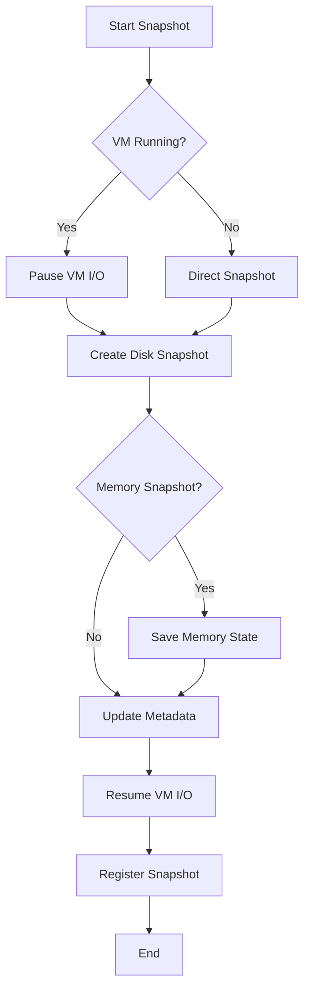

# Nova Snapshot System Technical Documentation

This document provides comprehensive technical details about Nova's snapshot functionality, implementation, and best practices.

## Table of Contents
- [Overview](#overview)
- [Snapshot Types](#snapshot-types)
- [Technical Implementation](#technical-implementation)
- [Snapshot Tree Structure](#snapshot-tree-structure)
- [Storage Architecture](#storage-architecture)
- [Performance Considerations](#performance-considerations)
- [Advanced Features](#advanced-features)
- [Best Practices](#best-practices)
- [Troubleshooting](#troubleshooting)

## Overview

Nova's snapshot system provides comprehensive VM state capture and restoration capabilities, supporting multiple snapshot types and advanced features like branching, merging, and incremental snapshots.

### Key Features
- **Multiple snapshot types**: Internal, External, Memory, Disk-only
- **Snapshot trees**: Branching and merging with parent-child relationships
- **Incremental snapshots**: Space-efficient delta storage
- **Live snapshots**: Capture running VM state without downtime
- **Atomic operations**: Consistent snapshot creation and restoration
- **Metadata management**: Rich snapshot information and search capabilities

## Snapshot Types

### 1. Internal Snapshots

Internal snapshots are stored within the QCOW2 disk image file itself.

**Advantages:**
- Single file management
- Fast creation and deletion
- Automatic cleanup when base image is deleted

**Disadvantages:**
- Limited by QCOW2 format
- Can impact disk performance
- All snapshots lost if base image is corrupted

**Technical Details:**
```bash
# QCOW2 internal snapshot creation
qemu-img snapshot -c snapshot_name disk.qcow2

# List internal snapshots
qemu-img snapshot -l disk.qcow2

# Apply internal snapshot
qemu-img snapshot -a snapshot_name disk.qcow2
```

**Use Cases:**
- Development environments
- Quick checkpoint saves
- Single-user VMs

### 2. External Snapshots

External snapshots create overlay files that contain only the changes since the snapshot.

**Advantages:**
- Better performance for large VMs
- Flexible storage management
- Can be stored on different storage types
- Base image remains read-only

**Disadvantages:**
- More complex file management
- Multiple files to track
- Requires careful chain management

**Technical Details:**
```bash
# Create external snapshot
virsh snapshot-create-as vm_name snapshot_name \
  --diskspec vda,file=/path/to/overlay.qcow2

# Snapshot chain structure
base.qcow2 (read-only)
├── snapshot1.qcow2 (overlay)
│   └── snapshot2.qcow2 (overlay)
└── snapshot3.qcow2 (overlay)
```

**Use Cases:**
- Production environments
- Shared base images
- Large VMs with frequent snapshots

### 3. Memory Snapshots

Memory snapshots capture both disk state and VM memory/CPU state.

**Advantages:**
- Complete VM state preservation
- Instant restoration to exact running state
- Debugging capabilities

**Disadvantages:**
- Larger storage requirements
- Longer creation time
- VM must be running

**Technical Details:**
```bash
# Create memory snapshot
virsh snapshot-create-as vm_name snapshot_name \
  --memspec /path/to/memory.save \
  --diskspec vda,file=/path/to/disk_snapshot.qcow2

# Memory file contains:
# - CPU registers and state
# - RAM contents
# - Device state
```

**Use Cases:**
- Critical application states
- Debugging crashed applications
- Instant environment restoration

### 4. Disk-Only Snapshots

Disk-only snapshots capture only the storage state, not memory.

**Advantages:**
- Smaller storage footprint
- Faster creation
- Can be created on running or stopped VMs

**Disadvantages:**
- VM must be restarted from shutdown state
- Application state not preserved

**Technical Details:**
```bash
# Create disk-only snapshot
virsh snapshot-create-as vm_name snapshot_name \
  --disk-only \
  --diskspec vda,file=/path/to/disk_snapshot.qcow2
```

**Use Cases:**
- Filesystem-level backups
- OS update checkpoints
- Template creation

## Technical Implementation

### Snapshot Metadata Structure

```rust
pub struct VmSnapshot {
    pub id: String,                    // Unique identifier
    pub vm_name: String,              // Associated VM
    pub name: String,                 // User-friendly name
    pub description: String,          // User description
    pub snapshot_type: SnapshotType,  // Internal/External/Memory/DiskOnly
    pub created_at: DateTime<Utc>,    // Creation timestamp
    pub size_bytes: u64,              // Total size on disk
    pub vm_state: VmState,            // VM state when created
    pub parent_snapshot: Option<String>, // Parent snapshot ID
    pub children: Vec<String>,        // Child snapshot IDs
    pub is_current: bool,             // Current active snapshot

    // Technical metadata
    pub disk_files: Vec<SnapshotDisk>,
    pub memory_file: Option<PathBuf>,
    pub config_snapshot: Option<String>,
}

pub struct SnapshotDisk {
    pub device: String,               // vda, vdb, etc.
    pub file_path: PathBuf,          // Snapshot file location
    pub format: String,               // qcow2, raw, etc.
    pub size_bytes: u64,             // File size
    pub backing_file: Option<PathBuf>, // Parent/base file
}
```

### Snapshot Creation Process



### Libvirt Integration

Nova integrates deeply with libvirt for snapshot management:

```xml
<!-- Snapshot XML definition -->
<domainsnapshot>
  <name>snapshot_name</name>
  <description>Snapshot description</description>
  <state>running</state>
  <creationTime>1634567890</creationTime>
  <memory snapshot='external' file='/path/to/memory.save'/>
  <disks>
    <disk name='vda' snapshot='external'>
      <source file='/path/to/snapshot.qcow2'/>
    </disk>
  </disks>
  <domain>
    <!-- VM configuration at snapshot time -->
  </domain>
</domainsnapshot>
```

## Snapshot Tree Structure

### Tree Management

Nova maintains a complete snapshot tree for each VM:

```
VM: web-server
│
├─ base-install (root)
│  ├─ security-updates
│  │  └─ app-v1.0
│  │     ├─ app-v1.1
│  │     └─ testing-branch
│  │        └─ experimental-feature
│  └─ minimal-config
│     └─ production-ready
```

### Tree Operations

```rust
impl SnapshotTree {
    // Navigate tree structure
    pub fn get_path_to_root(&self, snapshot_id: &str) -> Vec<String>;
    pub fn get_all_descendants(&self, snapshot_id: &str) -> Vec<String>;
    pub fn find_common_ancestor(&self, snap1: &str, snap2: &str) -> Option<String>;

    // Tree modifications
    pub fn add_snapshot(&mut self, snapshot: VmSnapshot);
    pub fn remove_snapshot(&mut self, snapshot_id: &str) -> Result<()>;
    pub fn merge_branch(&mut self, source: &str, target: &str) -> Result<()>;
}
```

### Branch Management

```bash
# Create new branch from snapshot
nova snapshot branch web-server base-install new-feature-branch

# Switch between branches
nova snapshot switch web-server security-updates

# Merge branches
nova snapshot merge web-server testing-branch security-updates

# List all branches
nova snapshot branches web-server
```

## Storage Architecture

### File Organization

```
/var/lib/nova/snapshots/
├── vm_name/
│   ├── metadata.json           # Snapshot tree metadata
│   ├── snapshots/
│   │   ├── snapshot_id_1/
│   │   │   ├── disk_vda.qcow2  # Disk snapshot
│   │   │   ├── memory.save     # Memory state (if applicable)
│   │   │   └── metadata.json  # Snapshot-specific metadata
│   │   └── snapshot_id_2/
│   │       └── ...
│   └── chains/
│       ├── chain_1.json        # Snapshot chain definition
│       └── chain_2.json
```

### Storage Optimization

#### Copy-on-Write (COW) Efficiency
```bash
# QCOW2 backing file chain
base.qcow2 (10GB virtual, 2GB actual)
├── snap1.qcow2 (backing: base.qcow2, 500MB changes)
└── snap2.qcow2 (backing: snap1.qcow2, 200MB changes)

# Total storage: 2GB + 500MB + 200MB = 2.7GB
# vs. full copies: 10GB × 3 = 30GB
```

#### Compression and Deduplication
```rust
pub struct StorageOptimization {
    pub compression: CompressionType,  // zstd, lz4, gzip
    pub deduplication: bool,          // Block-level dedup
    pub thin_provisioning: bool,      // Sparse file allocation
}

impl StorageOptimization {
    pub fn optimize_snapshot(&self, path: &Path) -> Result<u64> {
        // Apply compression and deduplication
        // Return space saved
    }
}
```

### Snapshot Chain Management

```rust
pub struct SnapshotChain {
    pub base_image: PathBuf,
    pub overlays: Vec<SnapshotOverlay>,
    pub max_chain_length: usize,
    pub auto_consolidate: bool,
}

impl SnapshotChain {
    pub fn consolidate(&mut self) -> Result<()> {
        // Merge overlays when chain gets too long
        if self.overlays.len() > self.max_chain_length {
            self.merge_overlays()?;
        }
        Ok(())
    }

    pub fn validate_integrity(&self) -> Result<()> {
        // Check backing file references
        // Verify file existence and accessibility
    }
}
```

## Performance Considerations

### Snapshot Creation Performance

| Snapshot Type | VM Size | Creation Time | Storage Overhead |
|---------------|---------|---------------|------------------|
| Internal      | 10GB    | 2-5 seconds   | ~5%             |
| External      | 10GB    | 1-3 seconds   | ~2%             |
| Memory        | 8GB RAM | 10-30 seconds | RAM size        |
| Disk-only     | 10GB    | 1-2 seconds   | ~1%             |

### Performance Optimization Strategies

#### 1. Snapshot Creation
```rust
pub struct SnapshotConfig {
    pub async_creation: bool,         // Background snapshot creation
    pub io_throttling: Option<u64>,   // Limit I/O during creation
    pub parallel_disks: bool,         // Snapshot multiple disks in parallel
    pub memory_compression: bool,     // Compress memory snapshots
}
```

#### 2. Chain Length Optimization
```bash
# Automatic chain consolidation
nova snapshot configure web-server \
  --max-chain-length 10 \
  --auto-consolidate \
  --consolidate-threshold 80%  # When chain uses 80% more space
```

#### 3. I/O Performance
```bash
# Use fast storage for active snapshots
nova snapshot configure web-server \
  --active-storage /fast-ssd/snapshots \
  --archive-storage /slow-hdd/archive

# Snapshot with I/O throttling
nova snapshot create web-server checkpoint \
  --io-limit 50MB/s \
  --background
```

## Advanced Features

### Incremental Snapshots

```rust
pub struct IncrementalSnapshot {
    pub base_snapshot: String,
    pub changed_blocks: Vec<BlockRange>,
    pub block_size: u64,
    pub compression: CompressionType,
}

impl IncrementalSnapshot {
    pub fn create_incremental(&self, base: &str, target: &str) -> Result<()> {
        // Calculate changed blocks since base snapshot
        let changes = self.calculate_block_changes(base, target)?;

        // Create incremental snapshot with only changed blocks
        self.store_incremental_data(changes)?;

        Ok(())
    }
}
```

### Snapshot Scheduling

```bash
# Schedule automatic snapshots
nova snapshot schedule web-server \
  --daily 02:00 \
  --weekly sunday:03:00 \
  --monthly first-sunday:04:00 \
  --retain-daily 7 \
  --retain-weekly 4 \
  --retain-monthly 12

# Conditional snapshots
nova snapshot schedule web-server \
  --on-shutdown \
  --on-significant-changes 10%  # When 10% of disk changes
  --on-uptime 24h              # Every 24 hours of uptime
```

### Snapshot Verification

```rust
pub struct SnapshotVerification {
    pub checksum_algorithm: ChecksumType,  // SHA-256, Blake3, etc.
    pub verify_on_creation: bool,
    pub periodic_verification: bool,
    pub repair_corruption: bool,
}

impl SnapshotVerification {
    pub fn verify_snapshot(&self, snapshot_id: &str) -> VerificationResult {
        // Verify file integrity
        // Check backing file chains
        // Validate metadata consistency
    }

    pub fn repair_snapshot(&self, snapshot_id: &str) -> Result<()> {
        // Attempt to repair corrupted snapshots
        // Recreate from parent if possible
    }
}
```

### Snapshot Export/Import

```bash
# Export snapshot to portable format
nova snapshot export web-server checkpoint \
  --format ova \
  --compress \
  --include-config \
  --output web-server-checkpoint.ova

# Import snapshot
nova snapshot import web-server-checkpoint.ova \
  --vm-name imported-web-server \
  --storage-pool default

# Cross-hypervisor compatibility
nova snapshot export web-server checkpoint \
  --format vmware \
  --compatibility vmware-workstation-16
```

## Best Practices

### 1. Snapshot Naming Convention

```bash
# Recommended naming scheme
<vm-name>-<purpose>-<date>-<sequence>

Examples:
web-server-before-update-20231025-001
dev-vm-working-state-20231025-002
db-server-backup-weekly-20231025-003
test-env-clean-install-20231025-004
```

### 2. Retention Policies

```bash
# Example retention policy
nova snapshot policy web-server \
  --hourly-retain 24 \
  --daily-retain 7 \
  --weekly-retain 4 \
  --monthly-retain 12 \
  --yearly-retain 3 \
  --auto-cleanup
```

### 3. Snapshot Organization

```bash
# Use tags for organization
nova snapshot create web-server update-checkpoint \
  --tags "update,security,automatic" \
  --category "maintenance"

# Search by tags
nova snapshot list web-server --tags security
nova snapshot list --category maintenance
```

### 4. Performance Guidelines

```yaml
# Performance recommendations
snapshot_guidelines:
  creation:
    - Avoid snapshots during high I/O periods
    - Use background creation for large VMs
    - Consider VM pause for critical consistency

  management:
    - Keep chain length under 10 snapshots
    - Consolidate chains regularly
    - Monitor storage space usage

  restoration:
    - Test snapshot restoration regularly
    - Keep recent snapshots on fast storage
    - Plan for restoration time in DR scenarios
```

### 5. Security Considerations

```bash
# Snapshot encryption
nova snapshot create web-server encrypted-backup \
  --encrypt \
  --key-file /secure/keys/snapshot.key

# Access control
nova snapshot permissions web-server checkpoint \
  --owner admin \
  --group developers \
  --mode 640

# Audit logging
nova snapshot audit web-server --enable
```

## Troubleshooting

### Common Issues

#### 1. Snapshot Creation Failures

```bash
# Insufficient disk space
Error: Cannot create snapshot: insufficient disk space
Solution: nova storage cleanup --free-space 10GB

# VM locked by another operation
Error: VM locked by another operation
Solution: nova unlock web-server --force

# Backing file chain too long
Warning: Snapshot chain length exceeds recommended limit
Solution: nova snapshot consolidate web-server --auto
```

#### 2. Snapshot Corruption

```bash
# Detect corruption
nova snapshot verify web-server checkpoint
# Output: FAILED - checksum mismatch

# Repair if possible
nova snapshot repair web-server checkpoint
# or recreate from parent
nova snapshot recreate web-server checkpoint --from-parent
```

#### 3. Performance Issues

```bash
# Slow snapshot creation
nova snapshot diagnose web-server --performance
# Check I/O patterns, disk fragmentation, chain length

# Storage space issues
nova snapshot analyze web-server --storage
# Show space usage, recommend cleanup actions
```

### Debug Commands

```bash
# Verbose snapshot creation
nova snapshot create web-server debug-test --verbose --debug

# Snapshot internals
nova snapshot inspect web-server checkpoint --show-internals

# Chain analysis
nova snapshot chain-info web-server --detailed

# Performance profiling
nova snapshot profile web-server checkpoint --duration 30s
```

### Log Analysis

```bash
# Snapshot operation logs
tail -f /var/log/nova/snapshots.log

# Libvirt integration logs
journalctl -u libvirtd -f | grep snapshot

# QEMU snapshot logs
tail -f /var/log/libvirt/qemu/vm-name.log | grep snapshot
```

## API Reference

### REST API Endpoints

```yaml
# Snapshot management endpoints
GET    /api/v1/vms/{vm_name}/snapshots        # List snapshots
POST   /api/v1/vms/{vm_name}/snapshots        # Create snapshot
GET    /api/v1/vms/{vm_name}/snapshots/{id}   # Get snapshot info
DELETE /api/v1/vms/{vm_name}/snapshots/{id}   # Delete snapshot
POST   /api/v1/vms/{vm_name}/snapshots/{id}/revert  # Revert to snapshot

# Snapshot tree operations
GET    /api/v1/vms/{vm_name}/snapshot-tree    # Get snapshot tree
POST   /api/v1/vms/{vm_name}/snapshot-tree/merge  # Merge snapshots
```

### Programming Interface

```rust
use nova::snapshots::*;

// Create snapshot manager
let mut manager = SnapshotManager::new("/var/lib/nova/snapshots")?;

// Create snapshot
let snapshot_id = manager.create_snapshot(
    "web-server",
    "checkpoint",
    "Before major update",
    true  // include memory
).await?;

// List snapshots
let snapshots = manager.list_snapshots("web-server");

// Revert to snapshot
manager.revert_to_snapshot("web-server", &snapshot_id).await?;
```

This technical documentation provides comprehensive coverage of Nova's snapshot system, from basic concepts to advanced implementation details and troubleshooting guidance.